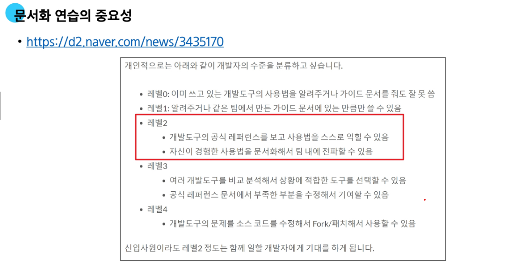

# 모듈
- 한 파일로 묶인 변수와 함수의 모음
### math 내장 모듈
- 파이썬이 미리 작성해 둔 수학 관련 변수와 함수가 작성됨 모듈
---
### 모듈 활용 방법
> import 문 사용(권장)
> - 같은 이름의 함수가 여러 모듈에 있을 때 충돌 방지 가능
> - "dot 연산자 : 점의 왼쪽 객체에서 점의 오른쪽 이름을 찾아라." 라는 의미(ex math.pi) -> 그냥 pi는 의미하는 바가 없음. 
> - 단점 : 코드가 길어질 수도 있다.
> from 절 사용 
> - ex from math import pi, sqrt --> 밑에 math.pi가 아니라 그냥 pi를 쓰면 됨.
> - 단점 : 모듈에서 가져온 값인지, 사용자가 임의로 정한 값인지 인지하기 어려움. -> 사용자가 선언한 변수와 겹칠 수도 있어 동작이 이루어지지 않을 수도 있음.
> - from 절 사용 시 주의사항 : 서로 다른 모듈에서 import 된 변수나 함수의 이름이 같은 경우 충돌 발생(나중에 import된 것만 유효함)
> - 모든 요소를 한 번에 import하는 * 표기는 권장하지 않음.
---
### as 키워드를 사용하여 별칭을 부여
- 두 개 이상의 모듈에서 동일한 이름의 변수, 함수, 클래스 등을 가져올 때 발생하는 이름 충돌 해결
-  ex matplotlib.pyplot as plt -> matplotlib.pyplot를 plt로 별명 설
---
### 사용자 정의 모듈

# 파이썬 표준 라이브러리
- 라이브러리 안에는 수많은 패키지, 패키지 안에는 수많은 모듈이 존재함.
- 파이썬 언어와 함께 제공되는 다양한 모듈과 패키지 모음
- 파이썬을 설치하면 자동으로 사용할 수 있는 기본 라이브러리
- 바로 import해서 사용 가능, 다양한 기능이 내장됨.
### 패키지
- 연관된 모듈들을 하나의 디렉토리에 모아 놓은 것
- from my_package.math import my_math : from은 경로, import는 가져오는 모듈
- 파이썬 외부 패키지(Third-party Packages) : 필요한 기능을 사용하기 위해 직접 설치해서 쓰는 패키지, 사용할 패키지를 설치할 때는 ***pip*** 명령어를 사용
- ex pandas, openpyxl, matplotlib, request
- pip : 외부 패키지를 설치하도록 도와주는 파이썬의 패키지 관리 시스템(pip install '패키지 이름' <- 설치 과정)
- requests 패키지 : 파이썬에서 웹에 요청을 보내고 응답을 받는 걸 아주 쉽게 만들어주는 외부 패키
- 패키지 삭제? : pip delete all
example
```python

# requests 패키지 사용 예제
# requests 패키지 설치해야 정상 동작

import requests

# 공휴일 정보 API
# url 주소에 요청을 보내서 응답 데이터를 받아 딕셔너리로 변겨하는 코드
url = "https://date.nager.at/api/v3/publicholidays/2026/KR"
response = requests.get(url).json() # .get(url) : 주어진 url로 요청하는 requests 패키지 메서드
# .json() : 문자열로 이루어진 json 자료형을 dict 자료형으로 변환시키는 requests 패키지 메서드
print(response)
```
---
# 제어문
- 코드의 실행 흐름을 제어하는 데 사용되는 구문
- 조건에 따라 코드를 실행하거나, 반복적으로 코드를 실행
- 조건문 : if, elif, else / 반복문 : for, while / 반복문 제어 키워드 : break, continue
### 조건문 
- 주어진 조건식을 평가하여 해당 조건이 참인 경우에만 코드 블록을 실행하거나 건너뜀.
- if문 : 조건문의 기본 형태, 작성되는 조건은 **표현식**으로 작성
- elif문 : 추가로 다른 조건이 필요할 때 사용, 여러 개의 elif문 사용 가능
- else문 : 모든 조건을 만족하지 않으면 실행
- 복수 조건문 : 조건을 순차적으로 보기 때문에 조건식의 순서가 중요! / 중첩 조건문 : if 내부에 또 다른 조건문 작성 가

# 반복문
- 주어진 코드 블록을 여러 번 반복해서 실행하는 구문
- for문 : 반복 가능한 객체(iterable)를 돌림. 특징 : 반복 횟수가 정해져 있음.
- while문 : while 조건이 참인 경우 반복. 특징 : 반복 횟수가 정해지지 않음.(False가 될 때까지)
- 반복 가능한 객체(iterable) : 요소를 하나씩 반환할 수 있는 모든 객체(list, tuple, str, dict, set : 시퀀스 자료형, 비 시퀀스 자료형) / (int는 안됨. 쓰려면 range 사)
- 중첩 반복문(헷갈림 주의!)
- 

- while문의 반복 원리 : 참이면 코드 실행 거짓이면 반복 종료 
- while문은 반드시 종료 조건이 필요함.
- break : 해당 키워드를 만나면 남은 코드를 무시하고 반복 즉시 종료 / continue : 해당 키워드를 만나면 다음 코드는 무시하고 다음 반복을 수행
- pass : 코드의 구조를 잡을 때 사용, 아무런 동작도 나타내지 않을 때 사용


## map 함수
- map(function, iterable) : 반복 가능한 데이터구조의 모든 요소에 function을 적용하고, 그 결과 값들을 map object로 묶어서 반환
- map 함수 활용 : swea 문제의 input 처럼 문자열 1 2 3이 입력 되었을 때 활용 예시
  ```python
  numbers1 = input().split()
  print(numbers1) # ['1', '2', '3']
  numbers2 = list(map(int, input().split()))
  print(numbers2) # [1, 2, 3]

#### zip 함수
- 여러 개의 반복 가능한 데이터 구조를 묶어 같은 위치의 값들을 tuple로 묶은 뒤 그것들을 모아 zip object로 반환하는 함수
- ex
- 