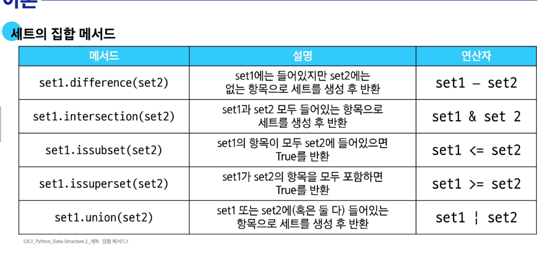

# 딕셔너리
- 키와 값을 짝지어 저장하는 자료구조
- 해시 테이블을 사용
# 딕셔너리 메서드
- .get(key[,default]) : 키 연결된 값을 반환하거나 키가 없으면 None 혹은 기본값(get(a, b)에서 b의 )을 반환
- person['country'], person.get('country')랑 key 값이 없을 때 차이가 발생함.
- .keys() : 딕셔너리 키를 모은 객체를 반환
- .values() : 딕셔너리 값을 모은 객체를 반환
- .items() : 딕셔너리 키/값 쌍을 모은 객체를 반환
- .clear() : 딕셔너리의 모든 키/값 쌍을 제거
### 추가로 알면 좋은 method
- .setdefault(key[,default]) : 키와 연결된 값을 반환, 키가 없다면 default와 연결한 키를 딕셔너리에 추가하고 default를 반환
- .update(*[other]*) : other가 제공하는 키/값 쌍으로 딕셔너리를 갱신하고 기존 키는 덮어씀.(other에는 키/값 쌍이 들어가야 함.)

# set
- 고유한 항목들의 정렬되지 않은 컬렉션
- 해시 테이블을 사용
# set 메서드
- .add(x) : 세트에 x를 추가
- .reomve(x) : 세트에서 항목 x를 제거, 항목 x가 없을 경우 keyError
- .clear() : 세트의 모든 항목을 제거 -> {}가 아니라 set()로 표현됨.
- .pop() : 세트에서 임의의 요소를 제거하고 반환, 다른 요소의 pop과 다르게 순서가 없기 때문에 마지막 것을 제거하는 것이 아니라 임의의 요소를 제거함!!!
# set의 집합 메서드
- 

# defaultdict
- 딕셔너리에 존재하지 않는 키를 조회할 때, 자동으로 '기본값(정수의 경우 0)'을 생성해주는 자료 구조
- 활용법 : defaultdict(자료형) / 자주 쓰는 패턴 : defaultdict(int) 0으로 초기화, defaultdict(list) -> []로 초기화

# 파이썬 문법 규격
- 문법을 설명하기 위해 확장 BNF 표기법 사용.
- BNF : 프로그래밍 언어의 문법을 표현하기 위한 표기법 / EBNF : BNF를 확장
- EBNF 메타기호 : ( [] : 선택적 요소), ( {} : 0번 이상 반복), ( () : 그룹화)

# 해시 테이블
- 키와 값을 짝지어 저장하는 자료구조
- 원리 : 키를 해시 함수를 통해 해시 값으로 변환 -> 변환된 해시 값을 인덱스로 삼아 데이터를 저장하거나 찾음. -> 이로 인해 검색, 삽입, 삭제를 매우 빠르게 수행
- 해시 : 임의의 크기를 가진 데이터를 고정된 크기의 고유한 값으로 변환하는 것
- 해시 함수 : 임의 길이 데이터를 입력 받아 고정 길이(정수)로 변환하는 함수. 이 '정수'가 바로 해시 
- set : 순서가 아니라 버킷 위치가 요소의 위치를 결정함.
- dict : 키 -> 해시 함수 -> 해시 값 -> 해시 테이블에 저장. / set와 달리 삽입 순서는 유지하기 때문에 키를 추가한 대로 반복문을 순회할 때 나오게 됨.
- set pop 메세드 예시
  > 정수 : 정수 값은 해시 값이 자기 자신과 동일하거나 단순 계산으로 고정
  > 문자열 : 해시 계산 시 해시 난수화가 적용되어, 실행마다 순서가 달라짐.
  > ***임의라는 의미에서 무작위지만 random은 아니다. 버킷에 배치된 순서대로 가져오는 것이기 때문에***
- 파이썬에서의 해시 함수 
  > 정수 : 같은 정수는 항상 같은 해시 값을 가짐.
  > 문자열 : 난수 시드가 달라질 수 있어 각 실행마다 해시 값이 바뀜.
- hashable : hash()함수에 넣어 해시 값을 구할 수 있는 객체를 의미. / 대부분의 불변 타입은 해시 가능(int, float, str, tuple) , 가변 데이터는 기본적으로 해시 불가능.(값이 변하면 해시 값도 달라질 수 있기 때문에)
  > 불변 데이터 안에 가변 데이터가 있을 경우에도 해시 불가능.