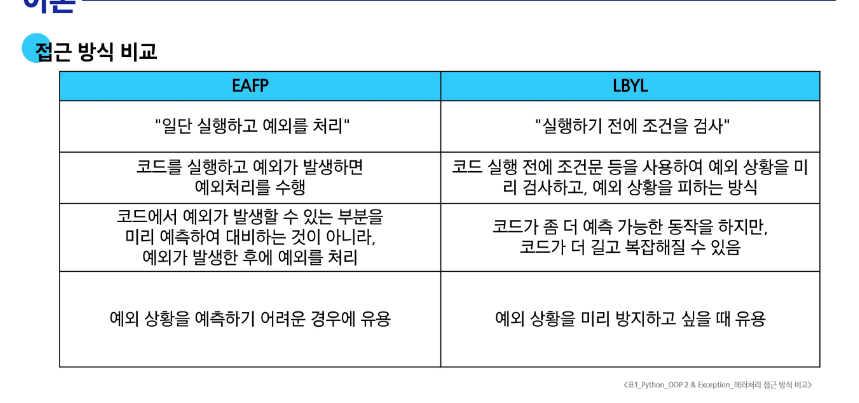

# 상속
- 한 클래스(부모)의 속성과 메서드를 다른 클래스(자식)가 물려받는 것
- 필요한 이유? : 코드의 재사용, 계층 구조 형성, 유지 보수의 용이성
- 예시 : 게임을 구성할 때 캐릭터의 기본적인 성질(공통점)을 구성하고(상위 캐릭터), 각 캐릭터별 특징에 따라 추가 속성을 구현(하위 캐릭)
- 상속 없이 구현하는 경우 : 학생/교수 정보를 별도로 표현하기 어려움. / 각각의 고유 속성을 표현하기 어렵다. -> 교수 학생 클래스로 각각 선언하여 구현함.

## 메서드 오버라이딩
- 부모 클래스의 메서드를 같은 이름, 같은 파라미터 구조로 재정의하는 것
- 동일한 이름과 동일한 매개변수를 사용해야 함.
- 내부 동작은 원하는대로

# 다중 상속
- 둘 이상의 상위 클래스로부터 여러 행동이나 특징을 상속받을 수 있음.
- 중복된 속성이나 메서드가 있는 경우 상속 순서에 의해서 결정됨. 
- 예시
```python
# 다중 상속 예시
class Person:
    def __init__(self, name):
        self.name = name

    def greeting(self):
        return f'안녕, {self.name}'


class Mom(Person):
    gene = 'XX'

    def swim(self):
        return '엄마가 수영'


class Dad(Person):
    gene = 'XY'

    def walk(self):
        return '아빠가 걷기'


class FirstChild(Dad, Mom):
    def swim(self):
        return '첫째가 수영'

    def cry(self):
        return '첫째가 응애'


baby1 = FirstChild('아가')
print(baby1.cry())  # 첫째가 응애
print(baby1.swim())  # 첫째가 수영
print(baby1.walk())  # 아빠가 걷기
print(baby1.gene)  # ??
```
'class FirstChild(Dad, Mom): ' 이 부분에서 Dad가 먼저 나오기 때문에 Dad 클래스를 먼저 찾게 되고 gene가 XY가 출력되게 됨.
- 파이썬에서의 중복 해결 방안
> MRO(Method Resolutino Order)알고리즘을 사용하여 메서드를 탐색할 클래스의 순서를 미리 정의함
> C3 Linearization(선형화) 알고리즘을 적용
> 1. 자식 클래스 우선
> 2. 왼쪽 부모 우선(리스트에 나열된 순서대로(왼쪽에서 오른쪽으로)탐색)
> 3. 공통 부모 클래스는 모든 자식 클래스의 탐색이 끝난 뒤에 단 한번만 탐색
> ***순서가 헷갈릴 경우에는 ClassName.__mro__또는 ClassName.mro()를 입력해서 정답을 확인하기!


### super() 메서드
- MRO에 따라서 현재 클래스의 부모 클래스의 메서드나 속성에 접근할 수 있게 해주는 내장 함수
- 단일 상속 구조 및 다중 상속 구조에서 사용됨.
- 다중 상속 구조에서의 super 함수 : MRO 해석 순서에 따라서 각 클래스의 메서드를 찾아감.

### MRO가 필요한 이유
- 부모 클래스들이 여러 번 액세스 되지 않게 하기 위해서
- 순서 보존

# 에러와 예외
- 버그 : 소프트웨어에서 발생하는 오류나 결함.
- 디버깅 방법 : print함수 활용 / 개발환경에서 제공하는 기능 활용 / python tutor 활용
- 문법 에러 : 프로그램 구문이 올바르지 않은 경우
- 예외 : 실행 중에 감지되는 에러
- 내장 예외 : ZeroDivisionError, NameError, TypeError, ValueError, IndexError, KeyError, ImportError, ModuleNotFoundError, KeyboardInterrupt, IndentationError
- 예외 처리 : 예외가 발생할 때 프로그램이 비정상적으로 종료되지 않고, 적절하게 처리할 수 있도록 하는 방법
- 예외 처리 사용 구문 : try(예외가 발생할 수 있는 코드 작성), except(예외가 발생했을 때 실행할 코드 작성), else(예외가 발생하지 않았을 때 실행할 코드 작성), finally(예외 발생 여부와 상관없이 항상 실행할 코드 작성)
- try-except 구조 : 
```python
try:
    # 예외가 발생하는 코드
except 예외:
    # 예외 처리 코드
```
- else & finally
```python
try:
    # 코드
except 예외:
    # 예외 처리 코드
else:
    # 예외가 없을 때 실행하는 코드
finally:
    # 항상 실행되는 코드
```
- except Exception :  상위 클래스의 예외 처리 코드(Exception은 모든 예외를 포함하기 때문에 다른 예외를 포함시켜 아래의 예외를 모두 죽임.)
> 예외 코드는 상속 계층을 가지고 있기 때문에 하위 클래스까지 모두 포함하려면 하위 클래스를 제일 위에 두고 작동 시켜야함.
> 옳은 코드
```python
# 옳은 코드
# 가장 구체적인 예외부터 처리하고, 마지막에 범용 예외를 처리하도록 순서를 배치
try:
    num = int(input('100으로 나눌 값을 입력하시오 : '))
    print(100 / num)
# 1) 구체적인 예외부터
except ZeroDivisionError:
    print('0으로 나눌 수 없습니다.')
except ValueError:
    print('숫자를 넣어주세요.')
# 2) 마지막에 광범위한 예외(Exception)
except Exception:
    print('에러가 발생하였습니다.')
```
# EAFP, LBYL 
- EAFP : 예외 처리를 중심으로 코드를 작성하는 접근 방식
- LBYL : 값 검사를 중심으로 코드를 작성하는 접근 방식
- 


# 클래스의 의미와 활용 
- 왜 클래스를 배웠을까? : 변수와 함수만으로도 간단한 프로그램을 만들 수 있었지만, 프로그램 규모가 커짐에 따라서 서로 관련 있는 정보와 기능을 따로따로 관리하기가 점점 어려워짐. 
- 클래스를 사용하면 관련 데이터와 기능을 묶어서 구조를 명확히 할 수 있다. 
- 작성한 코드가 훨씬 깔끔해지고, 수정하거나 기능을 추가할 때 더 쉽고 안전하게 진행할 수 있다. 
ㅇㅇㅇㅇㅇㅇㄹㅇㄹㅇㄹㅇ