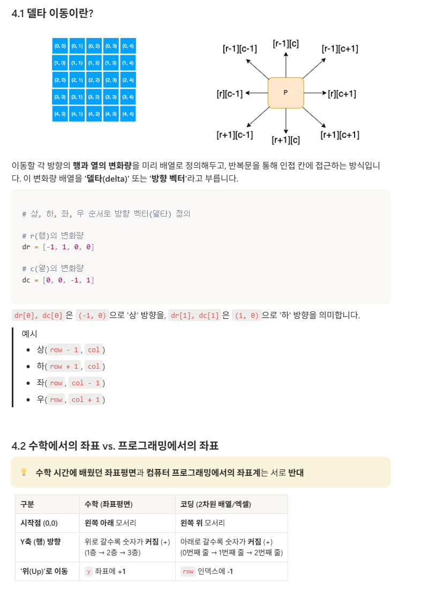

# 델타 이동




# 오늘 받은 피드백 중 중요한 것

- 리스트 언패킹을 적극 활용합시다!
  
> 잘못된 예시
```python
print(f'#{tc}')
    for row in arr:
        print(f'{" ".join(map(str, row))}')
```

> 잘 활용된 예시
```python
print(f"#{test_case}")
    for row in snail_matrix:
        print(*row)
```